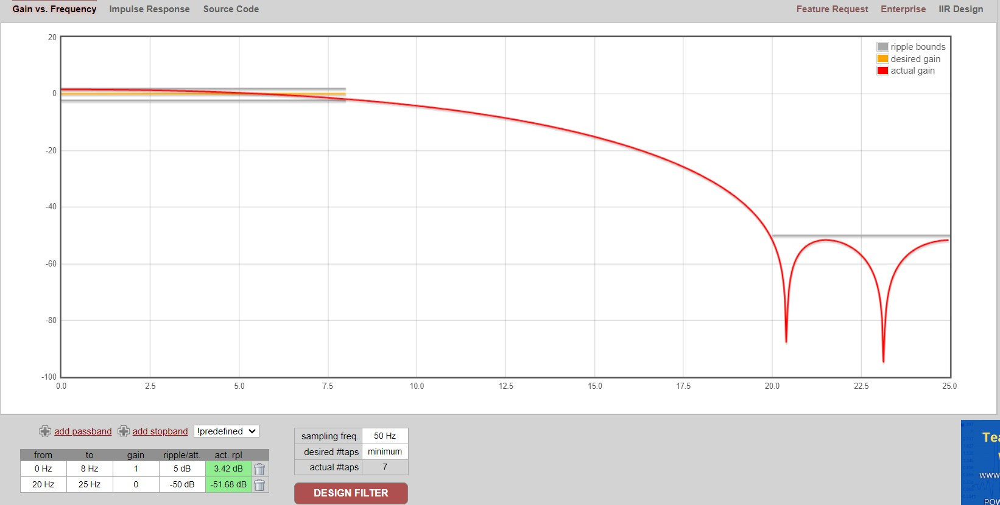
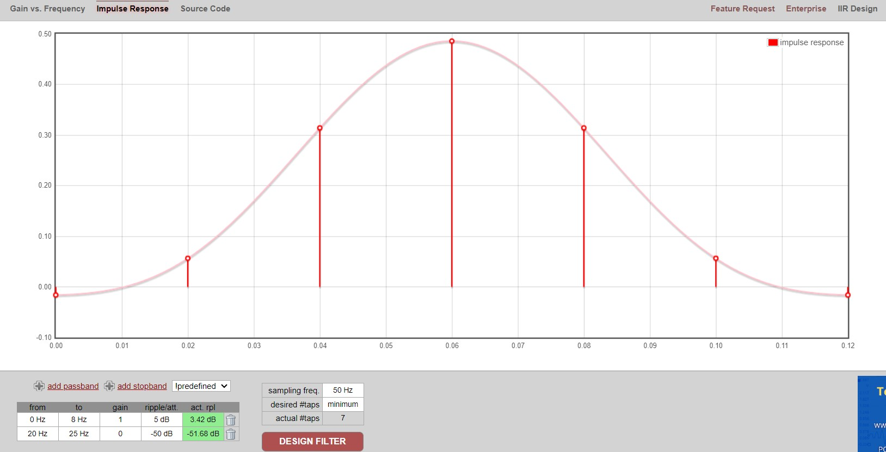

# Utils
utils contains functions, classes, headers, etc. written by our team for use on the project. It also contains a folder for unit tests.

## Files
For more documentation about each file. See the file header block.
- Robot.hpp
  - Type: Class
  - Use: Controls all of the robot's interfaces through simple commands.

- robotConstants.h
  - Type: header
  - Use: Define physical constants used for the robot.

- Vbase.h
  - Type: Class
  - Use: Calculating left and right wheel voltages from forward and rotational symbolic voltages.

- Tracker.h
  - Type: Class
  - Use: Given pointers to both encoders, keeps track of all position and velocity information. You must use update() every loop.
  - Metrics: Each of these metrics are tracked and can be accessed via a getter, e.g. phiPosRad can be accessed via getPhiPosRad().
    - phiSpeedRpS
    - RhoSpeedMpS
    - leftSpeedRpS
    - rightSpeedRpS
    - phiPosRad
    - rhoPosM
    - yPosM
    - xPosM
    - leftPosRad
    - rightPosRad
    - leftEncCnt
    - RightEncCnt
  - Filter: A FIR filter can be implemented for velocity readings. To turn filter on, `tracker.filterInputs(true);`
    - Gain: 
    - Impulse Response: 

